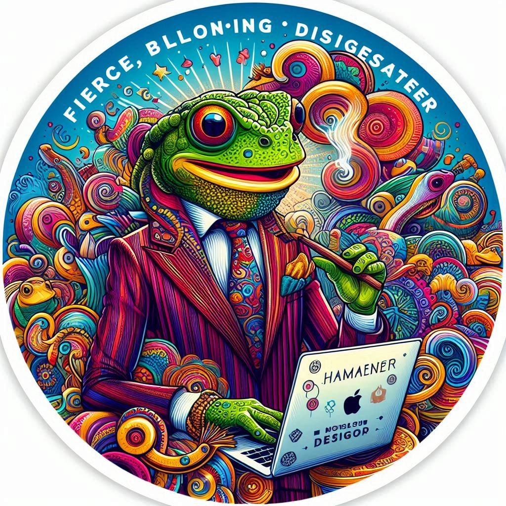

# cssGuden AutoChic CSS: The Ultimate CSS Library for Any Web Application

## Design Process
---------------

When designing AutoChic CSS, we asked ourselves:

### Who is our target audience?

Web developers, designers, and anyone looking to create a visually appealing web application.

### What are their needs and pain points?

A easy-to-use CSS library that can help them create a modern and responsive design without having to start from scratch.

### What are the current trends and best practices in web design?

Modular and flexible design, responsive design, and a focus on user experience.

### How can we create a CSS library that meets these needs and exceeds expectations?

By providing a comprehensive and modular CSS architecture, pre-designed components and layouts, and a focus on ease of use and customization.

## Design Principles
------------------

### Create a visually appealing and modern design that enhances the user experience

### Use a modular and flexible approach to make the library easy to customize and extend

### Focus on simplicity and ease of use, while still providing advanced features and functionality

## Features
---------

### Responsive design for various screen sizes and devices

### Modular CSS architecture for easy customization

### Pre-designed components and layouts for common use cases

### Easy to use and integrate into your web projects

## Getting Started
---------------

1. **Link the AutoChic CSS file to your HTML document**
2. **Start building your web page using the provided components and layouts**
3. **Customize the styles to fit your needs using the modular CSS architecture**

## Contributing to AutoChic CSS
-----------------------------

If you'd like to contribute to the library, please follow these guidelines:

* **Fork the repository and create a new branch for your changes**
* **Follow the design principles and coding standards outlined above**
* **Write clean, modular, and well-documented code**
* **Submit a pull request for review and feedback**

## License and Attribution
-------------------------

AutoChic CSS is licensed under the MIT License.

Attribution is not required but appreciated. If you use AutoChic CSS in your project, please consider giving credit to the original authors.

## Version History
----------------

v1.0: Initial release of AutoChic CSS aka cssGuden

 

 

 